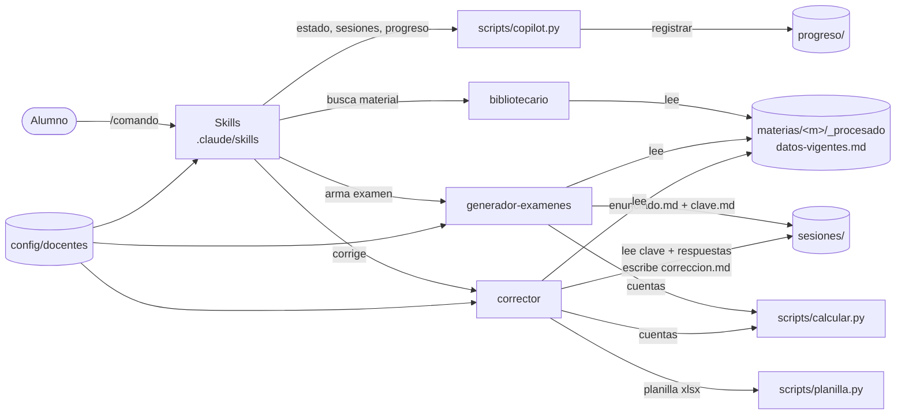
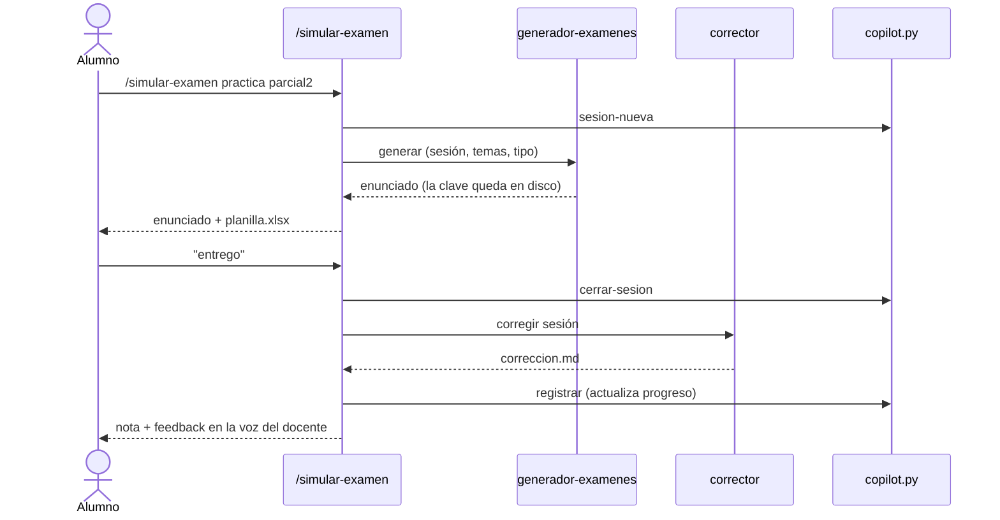

# 🎓 Profesor Copilot — Contador Público (FCE-UNL)

Copiloto de estudio para la carrera de **Contador Público Nacional** de la
[Facultad de Ciencias Económicas de la Universidad Nacional del Litoral](https://www.unl.edu.ar/carreras/contador-publico-nacional/).

Está hecho con **skills y subagentes de [Claude Code](https://claude.com/claude-code)**: abrís la carpeta con `claude`
y ya podés:

- 📝 **Hacer tandas de preguntas** con respuestas y feedback al final.
- 🧪 **Simular exámenes** de teoría, práctica o mixtos, al estilo de la cátedra y con la clave oculta.
- ✅ **Corregir** respuestas escritas o planillas Excel completadas.
- 📚 **Repasar temas** con explicaciones basadas en *tu* material, con citas normativas y cuentas verificadas.
- 📈 **Seguir tu progreso** por tema y detectar los puntos flojos.
- 🧑‍🏫 **Configurar la personalidad del docente**: exigente con los términos, enfocado en el proceso, coloquial, o
  un perfil propio que imite a tu profesor.
- 📂 **Cargar material nuevo** (resúmenes, exámenes viejos, resoluciones) y sumar otras materias.

> **Materia incluida:** Teoría y Técnica Impositiva I. Cubre Bienes Personales, Ganancias de personas humanas,
> Impuesto a los premios, RG 4003-E y RG 830, período fiscal 2025.

---

## Índice

1. [Instalación](#instalación)
2. [Inicio rápido](#inicio-rápido)
3. [Comandos](#comandos)
4. [Ejemplo de uso](#ejemplo-de-uso)
5. [Personalidad del docente](#personalidad-del-docente)
6. [Cargar material y nuevas materias](#cargar-material-y-nuevas-materias)
7. [Arquitectura](#arquitectura)
8. [Estructura de carpetas](#estructura-de-carpetas)
9. [Formatos de datos](#formatos-de-datos)
10. [Scripts (referencia)](#scripts-referencia)
11. [Reglas de exactitud](#reglas-de-exactitud)
12. [Estado del material de TTI I](#estado-del-material-de-tti-i)
13. [Solución de problemas](#solución-de-problemas)
14. [Aviso](#aviso)

---

## Instalación

**Requisitos**

| Herramienta | Versión |
|---|---|
| [Claude Code](https://claude.com/claude-code) | CLI, app de escritorio o extensión de IDE |
| Python | 3.10 o superior |
| Excel o LibreOffice | Opcional, para completar las planillas de práctica |

**Dependencias de Python**, una sola vez y desde la carpeta del proyecto:

```bash
python -m pip install -r requirements.txt
```

Instala `openpyxl`, `pandas`, `xlrd` (archivos `.xls` viejos), `pypdf`, `python-docx` y `PyYAML`.

## Inicio rápido

```bash
cd "D:\Documentos\Proyectos\profesor-copilot"
claude
```

Al iniciar, un hook muestra la materia actual, el docente activo y si hay sesiones pendientes. Escribí **"hola"** para
ver el menú o usá directamente un comando.

## Comandos

| Comando | Qué hace |
|---|---|
| `/tanda-preguntas [n] [tema] [--de-a-una]` | Genera *n* preguntas (V/F justificado, multiple choice, conceptuales, mini-casos). Respondés **todas** y recién ahí ves respuestas, nota y feedback. |
| `/simular-examen [teoria\|practica\|mixto] [alcance]` | Simulacro de parcial o final con tiempo sugerido. En práctica deja una planilla `.xlsx` editable en la sesión. Escribí **"entrego"** al terminar. |
| `/corregir [sesión \| ejercicio]` | Corrige la sesión pendiente, o un ejercicio que resolviste por tu cuenta (arma la clave desde el material). |
| `/repasar-tema <tema> [--breve\|--a-fondo]` | Explica el tema: idea central, norma, procedimiento, ejemplo numérico del material, errores típicos y preguntas de control. |
| `/mi-progreso [materia\|todas]` | Promedios, tendencia, temas flojos, temas nunca practicados y un plan sugerido. |
| `/configurar-docente [listar\|ver\|activar\|crear\|editar\|describir]` | Gestiona los perfiles de personalidad del docente. |
| `/cargar-material [archivo] \| nueva "Materia"` | Procesa lo que haya en `bandeja/` o da de alta una materia. |

No hace falta memorizarlos: también funciona con lenguaje natural, como *"tomame 5 preguntas de RG 830"*,
*"explicame la doceava parte"* o *"¿cómo vengo en Bienes Personales?"*.

## Ejemplo de uso

```text
> /tanda-preguntas 3 bienes personales

Prof. del Proceso: Vamos con 3 preguntas de Bienes Personales (PF 2025).
Respondé numerando en un solo mensaje; no te digo nada hasta que termines.

1. V o F (justificá): los inmuebles se valúan por su costo computable actualizado por IPC.
2. ¿Qué diferencia hay al liquidar el impuesto entre residentes y no residentes?
3. Casa de recreo comprada en 1/2020 en $ 10.000.000 (edificio 80%), con valuación fiscal 2017 de $ 1.150.000.
   ¿Qué valor va a la DDJJ?

> 1. Verdadero, se actualiza por IPC. 2. Los no residentes no tienen mínimo... 3. $ 9.040.000

Prof. del Proceso: Nota 5,5/10. Contame el camino en la 3: calculaste bien el valor residual,
pero ¿con qué lo tenías que comparar? …
```

Cada sesión queda guardada en `sesiones/` y la nota se registra en `progreso/`.

## Personalidad del docente

Los perfiles están en `config/docentes/<slug>.md`: un frontmatter YAML con los **ejes** y una descripción libre
(personalidad, qué le molesta, muletillas y criterios propios de corrección).

| Eje | Valores | Efecto |
|---|---|---|
| `rigor_terminologico` | 1 a 5 | Si acepta sinónimos informales o exige el término técnico exacto |
| `foco` | `resultado` / `equilibrado` / `proceso` | Cómo reparte el puntaje entre encuadre, procedimiento y resultado |
| `lenguaje` | `tecnico` / `mixto` / `coloquial` | Cómo habla al explicar y dar feedback |
| `exigencia_normativa` | `baja` / `media` / `alta` | Si descuenta por no citar artículo, DR o RG |
| `tolerancia_numerica` | `exacta` / `redondeo` / `criterio` | Cómo trata diferencias numéricas y errores arrastrados |
| `severidad` | 1 a 5 | Qué tan generoso es con los puntajes parciales |
| `estilo_feedback` | `directo` / `socratico` / `motivador` | Cómo arma la devolución |
| `repregunta`, `penaliza_omisiones` | `true` / `false` | Repreguntas de seguimiento y descuento por omisiones |

**Presets incluidos**

| Perfil | En una frase |
|---|---|
| `riguroso` | "Eso es aproximadamente correcto, es decir, incorrecto." Exige exactitud en términos, normas y cifras. |
| `del-proceso` *(activo por defecto)* | "El número se arregla con la calculadora; el criterio, no." Evalúa el razonamiento. |
| `coloquial` | "En criollo: …" Explica simple y no penaliza la falta de lenguaje técnico. |

**Qué podés hacer**

```text
/configurar-docente                          # listar perfiles y elegir qué hacer
/configurar-docente crear                    # asistente eje por eje
/configurar-docente describir "mi profe te pide el artículo de todo y no le importa si la cuenta da"
/configurar-docente activar riguroso         # activar globalmente
/configurar-docente activar coloquial --materia contabilidad-3   # docente distinto por materia
```

> La personalidad cambia el **tono y el criterio de corrección**, nunca la exactitud del contenido. Cada sesión guarda
> el docente con el que se creó, así que cambiar de perfil no altera correcciones anteriores.

## Cargar material y nuevas materias

### Agregar material

1. Copiá los archivos en `materias/<materia>/bandeja/`. Formatos: `.xlsx`, `.xls`, `.pdf`, `.docx`, imágenes.
2. Ejecutá `/cargar-material`. El copilot:
   1. Extrae el contenido a markdown con referencias de celda o página.
   2. Clasifica cada archivo como resumen, examen de teoría, examen práctico, resolución o plantilla (si duda, te pregunta).
   3. Lo mueve a su carpeta y guarda la extracción en `_procesado/`.
   4. Separa enunciado y resolución cuando un examen viene resuelto, para evitar spoilers.
   5. Actualiza `_procesado/indice.md` (tema → ubicación) y el banco de preguntas.
   6. Si detecta parámetros (MNI, escalas, alícuotas, vencimientos), **propone** cambios a `datos-vigentes.md` y pide
      confirmación antes de escribir.

> 💡 Cuantos más **exámenes viejos** cargues, más parecidos a los reales van a ser los simulacros.

### Nueva materia

```text
/cargar-material nueva "Contabilidad III"
```

Copia `materias/_plantilla-materia/` a `materias/contabilidad-3/`, pregunta los datos básicos y te deja lista la
bandeja. Con la materia creada, los mismos comandos funcionan para ella.

## Arquitectura



**Componentes**

| Capa | Archivo(s) | Rol |
|---|---|---|
| Instrucciones globales | `CLAUDE.md` | Rol, menú, reglas de exactitud, anti-spoiler y aplicación de la personalidad |
| Skills (comandos) | `.claude/skills/*/SKILL.md` | Orquestan cada flujo: preguntas al alumno, creación de sesión, llamadas a subagentes y presentación |
| Subagente `bibliotecario` | `.claude/agents/bibliotecario.md` | Búsqueda de solo lectura en el material. Devuelve hallazgos citados, parámetros y vacíos |
| Subagente `generador-examenes` | `.claude/agents/generador-examenes.md` | Crea enunciado y clave con puntajes. **Devuelve solo el enunciado** |
| Subagente `corrector` | `.claude/agents/corrector.md` | Aplica la clave y los ejes del docente, verifica cuentas y escribe la corrección con un bloque `resultado` |
| Scripts | `scripts/*.py` | Lógica determinística: estado, sesiones, progreso, extracción, planillas y cálculos |
| Configuración | `.claude/settings.json` | Permisos para los scripts y las carpetas de trabajo, y hook `SessionStart` de bienvenida |

**Flujo de un simulacro**



**Anti-spoiler:** la clave la escribe un subagente y la lee otro. El agente principal tiene prohibido abrir `clave.md`
mientras la sesión está `abierta` o `entregada`, y durante un simulacro no da pistas.

## Estructura de carpetas

```text
profesor-copilot/
├── CLAUDE.md                     # instrucciones permanentes del copilot
├── README.md
├── requirements.txt
├── .claude/
│   ├── settings.json             # permisos + hook de inicio
│   ├── skills/                   # 7 comandos (/tanda-preguntas, /simular-examen, ...)
│   └── agents/                   # bibliotecario, generador-examenes, corrector
├── config/
│   ├── copilot.yaml              # materia actual, docente activo/por materia, escala de notas
│   └── docentes/                 # riguroso.md, del-proceso.md, coloquial.md, _plantilla.md
├── materias/
│   ├── _plantilla-materia/       # esqueleto para nuevas materias
│   └── teoria-tecnica-impositiva-1/
│       ├── materia.md            # programa, temas con Id, formato de examen
│       ├── datos-vigentes.md     # parámetros del PF con fuente y estado
│       ├── bandeja/              # material nuevo sin procesar
│       ├── resumenes/
│       ├── examenes-anteriores/{teoria,practica}/
│       ├── resoluciones/
│       ├── plantillas/           # planillas Excel en blanco
│       └── _procesado/           # extracciones .md + indice.md
├── sesiones/                     # una carpeta por tanda/simulacro/ejercicio
├── progreso/                     # <materia>.json (datos) y <materia>.md (reporte)
└── scripts/
    ├── copilot.py                # estado, docente, sesiones, progreso
    ├── extraer_texto.py          # xlsx/xls/pdf/docx → markdown
    ├── planilla.py               # plantillas de práctica y lectura de planillas completadas
    └── calcular.py               # calculadora impositiva
```

## Formatos de datos

### `config/copilot.yaml`

```yaml
materia_actual: teoria-tecnica-impositiva-1
docente_activo: del-proceso
docente_por_materia: {}          # ej. { contabilidad-3: coloquial }
escala_notas: { minimo: 0, maximo: 10, aprobacion: 6 }
preferencias: { preguntas_por_tanda: 5, mostrar_tiempo_sugerido: true }
```

### Sesión (`sesiones/AAAA-MM-DD-HHMM-<tipo>-<materia>/`)

| Archivo | Quién lo escribe | Contenido |
|---|---|---|
| `sesion.yaml` | `copilot.py` | tipo, materia, docente, temas, estado y fechas |
| `enunciado.md` | generador | Consigna con puntajes y duración sugerida |
| `clave.md` | generador (o corrector si no hay) | Respuestas modelo, procedimiento, criterios, errores típicos y fuentes |
| `respuestas.md` / `respuesta-planilla.xlsx` | alumno / skill | Respuestas textuales o planilla completada |
| `correccion.md` | corrector | Nota, devolución, detalle por punto, qué repasar y bloque `resultado` |

Estados de `sesion.yaml`: `abierta` → `entregada` → `corregida`.

El bloque que consume `copilot.py registrar`:

````markdown
```resultado
nota: 7.25
aprobado: true
temas:
  - tema: "BP · valuación de inmuebles"
    puntaje: "2/4"
    observacion: "no comparó con valuación fiscal actualizada"
```
````

### `datos-vigentes.md`

Tablas de parámetros con **valor, estado y fuente** (`archivo › hoja › celda`):

- ✅ **Material:** tomado del material.
- 🔁 **Derivado:** verificado con cálculo.
- ⚠️ **Verificar:** hay dudas.
- ❌ **Falta:** no está en el material.

Las escalas progresivas se cargan como bloques que usa `calcular.py`:

````markdown
```tabla escala-art94-2025
0          | 1.000.000 | 0       | 5%
1.000.000  | inf       | 50.000  | 9%
```
````

Columnas: `desde | hasta | fijo | alícuota`. Los valores del ejemplo son ilustrativos.

## Scripts (referencia)

Todos se corren desde la raíz del proyecto.

### `copilot.py`: estado, sesiones y progreso

```bash
python scripts/copilot.py estado
python scripts/copilot.py docente [--materia SLUG]
python scripts/copilot.py activar-docente SLUG [--materia SLUG]
python scripts/copilot.py activar-docente --materia SLUG --quitar
python scripts/copilot.py materia SLUG
python scripts/copilot.py sesion-nueva --tipo simulacro|tanda|ejercicio [--materia SLUG] [--temas "BP; RG830"]
python scripts/copilot.py sesion-abierta [--materia SLUG]
python scripts/copilot.py cerrar-sesion RUTA_SESION
python scripts/copilot.py registrar RUTA_SESION
python scripts/copilot.py progreso [--materia SLUG] [--flojos N]
```

### `extraer_texto.py`: material a markdown

```bash
python scripts/extraer_texto.py "archivo.xlsx" "salida.md" [--formulas]
```

Soporta `.xlsx`, `.xls`, `.pdf` (con texto), `.docx`, `.md` y `.txt`. En planillas, cada fila sale con referencias de celda.

### `planilla.py`: planillas de práctica

```bash
python scripts/planilla.py nueva "materias/<m>/plantillas/<plantilla>.xlsx" "sesiones/<id>"   # copia editable (.xls → .xlsx)
python scripts/planilla.py leer "sesiones/<id>/respuesta-planilla.xlsx" --plantilla "<plantilla>"  # solo lo completado
```

### `calcular.py`: calculadora impositiva

```bash
python scripts/calcular.py expr "(6500000 - 4507505,52) * 15%"
python scripts/calcular.py amortizacion --costo 10000000 --pct-amortizable 80% --alta 2020-01 --cierre 2025-12
python scripts/calcular.py amortizacion --costo 15000000 --vida-periodos 193 --alta 2024-06 --cierre 2025-12   # mejora
python scripts/calcular.py ipc --valor 1150000 --coef 81.1035925946107
python scripts/calcular.py mayor 9040000 93269131,48
python scripts/calcular.py prorrateo --monto 4507505,52 --meses 12 --mes 2
python scripts/calcular.py tablas materias/teoria-tecnica-impositiva-1/datos-vigentes.md
python scripts/calcular.py escala --base 98521301,53 --tabla "materias/teoria-tecnica-impositiva-1/datos-vigentes.md:escala-art94-2025"
```

**Cómo lee los números:**

- Acepta formato argentino (`1.234.567,89`) y porcentajes (`0,5%`).
- Un punto seguido de exactamente 3 dígitos se toma como separador de miles (`50.000` = 50000).
- La amortización trimestral cuenta el trimestre de alta y el de cierre, como en el material de la cátedra.

## Reglas de exactitud

El copilot trabaja con estas reglas, definidas en `CLAUDE.md`:

1. **Período fiscal siempre explícito.**
2. **No inventa montos.** Usa solo `datos-vigentes.md` o el material, con cita. Si falta un dato, lo dice.
3. **Hace las cuentas con herramienta** (`calcular.py`), no de cabeza.
4. **Cita la norma** (ley, artículo, DR, RG, dictamen) y la ubicación en el material.
5. **Prioriza el material de la cátedra.** Si usa conocimiento general, lo marca como tal y pide verificar vigencia.
6. **Distingue conceptos que suelen confundirse:** exento / no gravado, retención / percepción, devengado / percibido,
   contribuyente / responsable sustituto.

## Estado del material de TTI I

**Material cargado**

| Material | Ubicación |
|---|---|
| Resumen BP 2025, premios, RG 4003-E, RG 830 (con temas del 2º parcial 2026) | `resumenes/` |
| Casos prácticos de Bienes Personales PF 2025 resueltos | `resoluciones/` |
| Examen práctico persona humana, caso *Francisco Olazabal* PF 2025 (enunciado limpio y resultados por separado) | `examenes-anteriores/practica/`, `resoluciones/` |
| Banco de 41 preguntas de teoría con remisión a la respuesta | `examenes-anteriores/teoria/` |
| Planillas en blanco: Ganancias persona humana y DDJJ Bienes Personales | `plantillas/` |

**Pendiente**

- ❌ Escala del art. 94 de Ganancias, escalas del art. 25 de Bienes Personales (cumplidor y no cumplidor) y escala de
  retención de la RG 830. Mientras falten, los ejercicios no dependen de ellas o dan el dato en el enunciado.
- ⚠️ Para confirmar con la cátedra:
  - La deducción por cónyuge tiene dos importes distintos en el material.
  - El coeficiente de la deducción especial de autónomos.
  - El umbral de la DDJJ informativa del empleado.
- 📭 Temas del programa sin material:
  - Tercera categoría y valuación (arts. 53-81)
  - Ajuste por inflación impositivo
  - Sociedad colectiva
  - Renta mundial
  - Impuesto a los débitos y créditos bancarios
  - Sociedad simple y explotaciones unipersonales
  - Derogación del Impuesto a la Transferencia de Inmuebles (ITI)
  - Todo el primer parcial

## Solución de problemas

| Problema | Solución |
|---|---|
| No aparecen los comandos `/...` | Abrí `claude` **desde la raíz del proyecto** y reiniciá la sesión si agregaste skills con Claude Code abierto. |
| `ModuleNotFoundError: xlrd` (u otro) | `python -m pip install -r requirements.txt` |
| No aparece el mensaje de bienvenida | Verificá que `python` esté en el PATH. El hook ejecuta `python scripts/copilot.py estado`. |
| La corrección no lee lo que puse en el Excel | Guardá y **cerrá** el archivo antes de decir "entrego". Si usaste fórmulas, abrilo y guardalo en Excel para que queden los valores calculados. |
| Un PDF sale "sin texto extraíble" | Es un escaneo. `/cargar-material` lo transcribe leyéndolo como imagen. |
| Quiero borrar mi historial | Eliminá `progreso/<materia>.json` y `.md`, y opcionalmente las carpetas de `sesiones/`. |
| Hay una sesión colgada sin corregir | `/corregir` para corregirla, o borrá su carpeta en `sesiones/`. |

## Aviso

Profesor Copilot es una **herramienta de estudio**. No reemplaza a la cátedra, a la normativa oficial ni al
asesoramiento profesional. Los criterios de corrección son aproximaciones configurables: ante cualquier diferencia,
**manda lo que diga tu docente**. Verificá siempre la vigencia de montos y normas (ARCA, ex AFIP) para el período
fiscal que corresponda.
